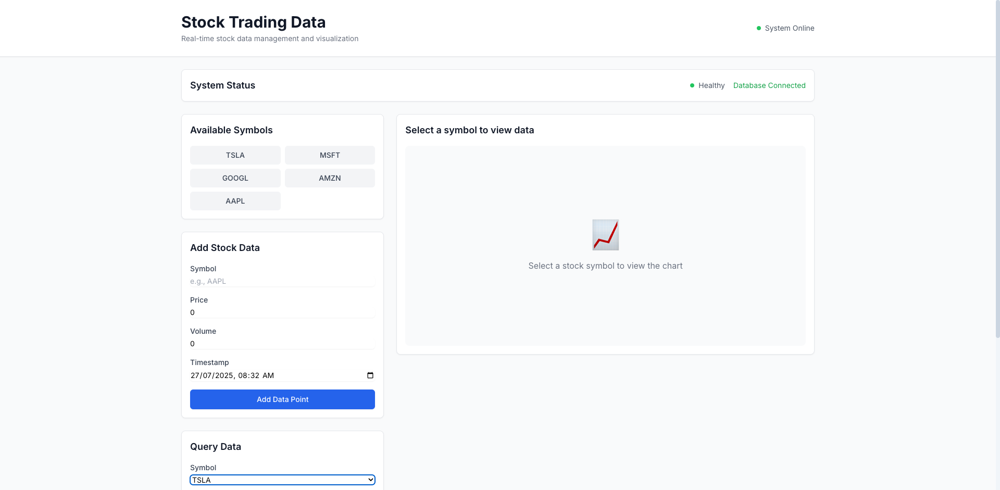

# Stock Trading Data Management System

## 📸 Screenshots

### Stock Trading Dashboard (TSLA Demo)



The application provides a comprehensive dashboard for stock trading data management with:

- **Interactive Charts**: Real-time price and volume visualization
- **Symbol Selection**: Choose from multiple stock symbols (AAPL, GOOGL, MSFT, TSLA, AMZN)
- **Data Input Forms**: Add new stock data points
- **Query Interface**: Custom time range and interval selection
- **Auto-loading**: Data automatically loads when symbols are selected

### Features Demonstrated:

- ✅ Real volume data (not zeros)
- ✅ Price line charts with volume bars
- ✅ Responsive design with Tailwind CSS
- ✅ Modern UI with clean styling
- ✅ Interactive tooltips on hover
- ✅ TSLA stock data visualization (high volatility example)

A comprehensive system for managing and querying large volumes of stock trading data using a time-series database.

## Features

- **High-Performance Data Storage**: Store large volumes of stock trade data for every trading day
- **Flexible Time Range Queries**: Query data by last hour, last 7 days, since inception, etc.
- **Multiple Time Intervals**: Support for days, hours, minutes, seconds granularity
- **Real-time Data Processing**: Efficient handling of streaming trade data
- **Clean Architecture**: Follows SOLID principles with proper separation of concerns

## Tech Stack

- **Database**: InfluxDB (Time-series database)
- **Backend**: Python 3 with FastAPI
- **Frontend**: React with TypeScript
- **Containerization**: Docker & Docker Compose
- **Testing**: pytest for backend, Jest for frontend

## Project Structure

```
timeseries/
├── backend/                 # Python FastAPI backend
│   ├── app/
│   │   ├── api/            # API routes
│   │   ├── core/           # Core configuration
│   │   ├── models/         # Data models
│   │   ├── services/       # Business logic
│   │   └── utils/          # Utilities
│   ├── tests/              # Backend tests
│   └── requirements.txt    # Python dependencies
├── frontend/               # React frontend
│   ├── src/
│   │   ├── components/     # React components
│   │   ├── hooks/          # Custom hooks
│   │   ├── services/       # API services
│   │   └── types/          # TypeScript types
│   ├── tests/              # Frontend tests
│   └── package.json        # Node dependencies
├── docker-compose.yml      # Docker orchestration
└── .editorconfig          # Editor configuration
```

## Getting Started

### Prerequisites

- Docker & Docker Compose
- Node.js 18+ (for local development)
- Python 3.11+ (for local development)

### Quick Start

1. Clone the repository
2. Run the entire stack:
   ```bash
   docker-compose up -d
   ```
3. Access the application:
   - Frontend: http://localhost:3000
   - Backend API: http://localhost:8000
   - InfluxDB: http://localhost:8086

## Development

### Backend Development

```bash
cd backend
python -m venv venv
source venv/bin/activate  # On Windows: venv\Scripts\activate
pip install -r requirements.txt
uvicorn app.main:app --reload
```

### Frontend Development

```bash
cd frontend
npm install
npm start
```

## Testing

### Backend Tests

```bash
cd backend
pytest
```

### Frontend Tests

```bash
cd frontend
npm test
```

## API Documentation

Once the backend is running, visit:

- Swagger UI: http://localhost:8000/docs
- ReDoc: http://localhost:8000/redoc

## Contributing

1. Create a feature branch from `main`
2. Make your changes following the coding standards
3. Write tests for new functionality
4. Submit a pull request
5. Ensure all tests pass and code quality checks are satisfied

## License

MIT License
